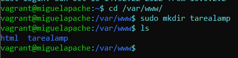
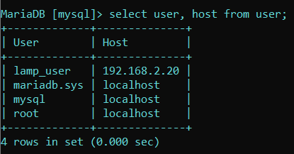

# Ejercicio Arquitectura LAMP en 2 niveles

>En esta arquitectura lo que se propone es crear dos maquinas virtuales debian en las cuales, una de ellas llevara instalado apache y php (con sus correspondientes modulos), y en la otra maquina instalaremos un servidor mysql. La maquina en la que instalaremos apache tendra dos interfaces, una configurada en red publica para que los usuarios puedan conectarse al servidor e interactuar con el, y la otra interfaz la configuraremos en red interna para que pueda conectarse al servidor donde estara corriendo mysql. La maquina en la cual alojaremos mysql, tendra una sola interfaz configurada en red interna, para que puedan estar conectados el servidor de apache y de mysql.
 
# Configuracion de las maquinas

>La configuracion de ambas maquinas se realizara mediante un script de aprovisionamiento en el cual escribiremos el codigo necesario para instalar apache, php y mysql para interactuar lo menos posible con los terminales de nuestras maquinas.

# Servidor Apache

>Primeramente, actualizamos repositorios con sudo apt update y upgrade. Seguidamente instalamos el servidor que va a tener nuestra maquina, en este caso instalamos apache y php. A parte de esto, hay que instalar unos modulos de php para que apache pueda interpretar codigo php.

>En el Vagrantfile configuramos nuestra maquina de apache con la direccion ip privada 192.168.2.20 y una direccion ip publica, que utilizaremos para conectarnos a la maquina mediante un navegador. Aprovisionamos la maquina con un script.

>Comprobamos que las dos maquinas tienen conectividad entre si mediante un ping.

# Pasos para configurar el servidor de Apache

### 1.

>Creamos dentro del directorio /var/www una carpeta llamada tarealamp. Comprobamos que la carpeta se ha creado.

### 2.

>Cambiamos el propietario y el grupo de la carpeta creada por el usuario www-data y el grupo www-data. Comprobamos que los cambios se han realizado correctamente.

### 3.

>Nos situamos dentro de la carpeta creada y clonamos dentro de ella el repositorio donde tenemos los archivos de configuracion de nuestra aplicacion. Comprobamos que el repositorio se ha clonado.

### 4.

>Entramos en el directorio src dentro del repositorio y movemos todos los archivos que hay dentro a la carpeta que hemos creado, es decir, movemos los archivos a la carpeta tarealamp. Cuando hayamos movido los archivos, podemos eliminar el repositorio, ya que no nos vale ya para nada.

### 5.

>Entramos en el directorio sites-available y hacemos una copia del fichero 000-default.conf y le damos un nombre, en este caso TAREALAMP.conf.

### 6.

>Editamos el fichero que hemos creado y ponemos la ruta de la carpeta que hemos creado al principio, es decir, tarealamp, ya que dentro de esa carpeta tenemos todos los ficheros de configuracion de nuestra aplicacion.

### 7.

>Habilitamos el fichero TAREALAMP.conf, para que a la hora de introducir la ip de la maquina en el navegador, la pagina web que aparezca sea la de nuestra aplicacion y no a pagina por defecto de apache.

### 8.

>Entramos en el directorio sites-enabled y deshabilitamos el fichero que hay en este directorio.

### 9.

>Instalamos el cliente mysql para poder utilizar comandos de sql para conectarnos al servidor donde esta corriendo MySql.

### 10.

>Reiniciamos apache para que las configuraciones realizadas se guarden.

### 11.

>Con el comando mysql -u lamp_user -p -h "direccion ip del servidor MySql" nos conectamos desde la maquina de apache al servidor MySql.

# Servidor MySql

>Primeramente, actualizamos los repositorios con sudo apt update y upgrade. Despues, instalamos mysql. Las ultimas lineas del script son para asignarle una contraseña al root.

>Configuramos el Vagrantfile para nuestro servidor mysql con una red privada, en la cual, tienen que estar el servidor apache y el servidor mysql. Aprovisionamos la maquina con un script.

# Pasos para configurar el servidor de MySql

### 1.

>Primero tenemos que modificar el archivo 50-server.cnf que se encuentra dento del directorio /etc/mysql/mariadb.conf.d. En este archivo, tenemos que cambiar el parametro de bind-address por la direccion del servidor donde esta corriendo MySql.

### 2.

>Seguidamente, hacemos un restart al servidor.

### 3.

>A continuacion, tenemos que estar dentro de mysql y crear un usuario, en este caso sera lamp_user, y, en vez de poner @localhost, tenemos que poner @"ip maquina apache". Despues, tenemos que asignarle privilegios a ese usuario en la base de datos de nuestra aplicacion. 

>Comprobamos que se ha creado el usuario en la tabla user de la base de datos mysql.

### 4.

>Ahora, tenemos que clonar el repositorio de git para insertar el archivo de la base de datos (lamp_db) en mysql.

### 5.

>En el archivo de la base de datos situado dentro del repositorio clonado anteriormente y dentro del directorio db (database.sql), tenemos que borrar las tres ultimas lineas de ese fichero porque, previamente, hemos creado el usuario y le hemos dado unos privilegios.

### 6.

>Importamos el fichero database.sql a mysql, y comprobamos que tenemos la base de datos creada.